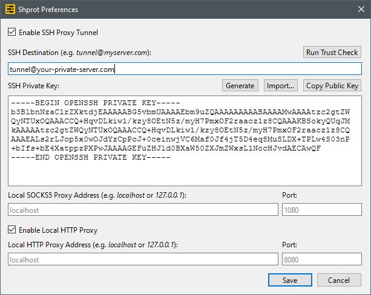

<h1> Shprot</h1>

🌐 **Languages:** [English](README.md) | [Русский](README.ru.md)

Shprot is a lightweight, cross-platform-ready GUI wrapper written in Qt/C++ designed to manage a highly resilient SOCKS5 proxy over an SSH tunnel. Unlike standard command-line tools, it constantly monitors network environments, executes periodic proxy health checks, and automatically revives stalled connections or adapts to Wi-Fi switches. It also simplifies infrastructure setup with integrated SSH key generation and customizable local routing parameters, ensuring an uninterrupted and secure browsing experience.

## ✨ Features

- **Automated SSH Tunneling:** Easily establish and manage secure SSH tunnels that route traffic through a local SOCKS5 proxy.
- **Smart Connection Resilience:** Automatically monitors internet status and network switches (e.g., changing Wi-Fi networks or waking from sleep) and transparently restarts the tunnel.
- **Advanced Health Checks:** Periodically verifies connection integrity by testing popular website availability through the proxy, reviving the tunnel instantly if the underlying SSH process stalls.
- **Integrated Key Management:** Simplifies client authentication with built-in SSH key generation, allowing you to easily copy your public key to the remote server's `authorized_keys`.
- **User-Friendly Authentication:** Provides a clean interface for managing remote server credentials and server/client authentication parameters.
- **Configurable Network Settings:** Full control over the local binding address and port settings for your SOCKS5 proxy server.

## 💻 System Requirements

Currently, Shprot is optimized and supported exclusively for **Windows** (10 / 11, 64-bit).

## 🚀 Installation

You can download the pre-compiled installer for Windows from the **[Releases](../../releases)** section. 

The installation package is created using NSIS. Simply run the downloaded `.exe` file and follow the setup wizard instructions.

## 🖥️ Server-Side Setup (Secure Hardening)

To ensure maximum security, it is highly recommended to create a dedicated, restricted user on your remote Linux server (e.g., Ubuntu/Debian) specifically for SSH tunneling. This prevents the tunneling account from accessing a command shell or executing arbitrary scripts on your server.

Follow these steps to configure your server:

### 1. Create a Restricted User
Run the following command to create a system user named `tunnel` with no login shell and a locked home directory:
```bash
sudo useradd -r -s /bin/false -m tunnel
```

### 2. Configure SSH Daemon
Open the SSH configuration file with root privileges:
```bash
sudo nano /etc/ssh/sshd_config
```

Scroll to the very bottom of the file and append the following `Match User` block. This explicitly isolates the `tunnel` user, disables interactive terminal allocation, and allows only TCP forwarding:
```text
Match User tunnel
    AllowTcpForwarding yes
    X11Forwarding no
    PermitTTY no
    ForceCommand echo "This account is for SSH tunneling only."
```
*Save the file and restart the SSH service to apply the changes: `sudo systemctl restart ssh`.*

### 3. Add Your Shprot Public Key
Now, install the public key generated by Shprot into the new user's environment. Switch to root or use `sudo` to set up the authorized keys file:
```bash
# Create the .ssh directory with correct permissions
sudo mkdir -p /home/tunnel/.ssh
sudo chmod 700 /home/tunnel/.ssh

# Append your Shprot public key
echo "your-shprot-public-key-here" | sudo tee -a /home/tunnel/.ssh/authorized_keys

# Fix ownership and permissions
sudo chmod 600 /home/tunnel/.ssh/authorized_keys
sudo chown -R tunnel:tunnel /home/tunnel/
```

Once configured, use `tunnel` as the **SSH username** when setting up the connection in the Shprot desktop application.

## 🔧 Application Configuration

Shprot operates completely independently of your system's global SSH configurations or pre-existing user keys, relying solely on its internal settings for enhanced isolation and security.



Follow these steps to configure the proxy tunnel:

### Step 1: Enable the Tunnel
1. Check the **"Enable SSH Proxy Tunnel"** checkbox. 
   * *Note: All other configuration controls remain safely disabled until this is checked. You can uncheck it at any time to temporarily disable the tunnel without losing your settings.*

### Step 2: Configure Remote Server (SSH Destination)
1. In the **"SSH Destination"** field, enter your connection details using the standard format: `username@host[:port]` (for example, `tunnel@192.0.2.1:22`).
2. *(Optional)* Click the **"Run Trust Check"** button above the field. This tests whether Shprot already trusts the host key. You can use this button later for manual troubleshooting if your server was reinstalled or if you suspect a network anomaly.

### Step 3: Set Up Client Key Authentication
1. Go to the **"SSH Private Key"** area. To provide a secure client key, you can:
   * Paste an existing private key text into the field.
   * Click **"Import…"** to load a key from a file.
   * Click **"Generate"** (Highly Recommended) to let Shprot instantly create a fresh cryptographic key pair.
2. Click **"Copy Public Key"** to copy the generated public key text to your clipboard.
3. Open your server terminal and append this key to the restricted user's file as shown in the Server Setup section.

### Step 4: Configure the Local SOCKS5 Proxy
1. Review the proxy routing parameters:
   * **Local SOCKS5 Proxy Address:** Defaults to `localhost` (restricts traffic to your local computer). Change it to `0.0.0.0` if you want to share the proxy with other devices in your LAN.
   * **Port:** Defaults to `1080`. You can change this if `1080` is already occupied by another service on your system.

### Step 5: Save and Establish Connection
1. Click the **"Save"** button. Shprot will automatically validate all fields. If any errors are found, the app will highlight the invalid fields and guide you on what to fix.
2. **Host Verification (First-time Connection):**
   If you are connecting to this server for the first time, a dialog box will appear displaying the remote server's **host key fingerprint**. 
   * *💡 Tech Tip (How to verify): To prevent Man-in-the-Middle attacks, you can verify this fingerprint by running `ssh-keygen -lf /etc/ssh/ssh_host_ed25519_key.pub` (or your specific host key file) directly on your server console and matching the output hash.*
3. Confirm trust in the dialog box. Shprot will save your parameters and immediately spin up the background engine to open and maintain the tunnel.

### 📊 Connection Status Indicators
You can easily track the tunnel status without opening the main window:
* **System Tray Icon:** A vibrant, **colored icon** means the tunnel is active and the SOCKS5 proxy is successfully serving traffic. A **grayscale icon** indicates that the tunnel is closed or disconnected.
* **Toast Notifications:** The app will send native Windows tray notifications whenever the tunnel successfully connects or drops.

## 🛠 Building and Development

### 1. Pre-requisites & Setup

Before building or opening the project, ensure you have the following environment configuration:

- **OS:** Windows 10/11 (64-bit)
- **Compiler:** MSVC 2022 (x64)
- **Framework:** Qt 6.8.3
- **Build System:** CMake (version 3.20 or higher)
- **Build Generator:** Ninja (highly recommended for faster compilation times) or MSBuild
- **Installer Generator:** NSIS (required for CPack packaging)

Follow these steps to clone the repository:

```bash
git clone https://github.com/andrew-markin/shprot.git
cd shprot
```

### 📦 Option A: Building the Release Package
The project includes an automated script to build the production bundle without manual compilation. To use it, you must first set up a local environment file so CMake can find your Qt installation:

1. Copy the environment template using CMake (works in any Windows terminal):
   ```bash
   cmake -E copy Environment.txt.example Environment.txt
   ```
2. Open the newly created `Environment.txt` file and update the `CMAKE_PREFIX_PATH` to point to your local Qt 6.8.3 MSVC installation. For example:
   ```cmake
   set(
       CMAKE_PREFIX_PATH
       "C:\\Users\\YourUsername\\Path\\To\\Qt\\6.8.3\\msvc2022_64"
   )
   ```
3. Run the automated release script from the project root directory:
   ```cmd
   MakeRelease.cmd
   ```
Once the script finishes execution, you can find the production-ready `.exe` installer inside the **`Release`** folder.

### 💻 Option B: Working with Code (Development)
If you want to modify the code, fix bugs, or add features, you should use **Qt Creator**:

1. Open **Qt Creator**.
2. Select **Open Project** and navigate to the **`Sources`** directory.
3. Open the **`CMakeLists.txt`** file located inside the `Sources` folder.
4. When prompted to configure the project, select your local **Qt 6.8.3 MSVC2022 64-bit Kit** configured in your IDE.
   * *Tip: For much faster build times, we highly recommend using **Ninja** as the CMake generator in your Kit settings instead of the default MSBuild.*
5. Set the **Build directory** to point to the **`Builds`** folder in the project root (e.g., `../Builds/build-Shprot-Desktop-Debug`).

Now you can write code, debug, and run the application directly from the IDE. Intermediate build files will be kept safe inside the `Builds` folder.

## 🤝 Contributing

We welcome contributions to Shprot! To get started:

1. **Fork** the repository and clone your fork locally.
2. Create a **new branch** for your changes (`git checkout -b feature/amazing-feature`).
3. Make sure your environment is configured correctly as described in the development section above.
4. Commit your changes (`git commit -m 'Add some amazing feature'`) and push them to your fork (`git push origin feature/amazing-feature`).
5. Open a **Pull Request** against our main repository.

*Before starting any major work, please open an [Issue](issues) first to discuss your ideas with the maintainers.*

## 📜 License

This project is licensed under the terms of the **GNU GPL v3** license. 

For the full license text, please see the accompanying [LICENSE](LICENSE) file in the root directory of this repository. You are free to redistribute and/or modify this software under the conditions outlined in the GPL v3.
