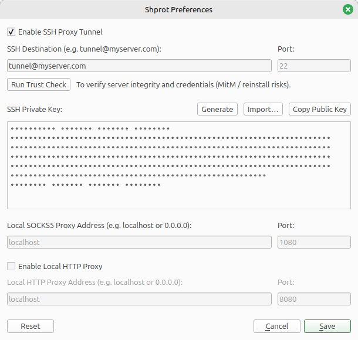

<h1> Shprot</h1>

🌐 **语言:** [English](README.md) | [Русский](README.ru.md) | [**简体中文**](README.zh.md)

**Shprot** 是一款桌面应用程序，为您提供可靠、自动恢复的 SOCKS5 代理（通过 SSH），无需使用命令行。

与标准的 SSH 隧道工具不同，它会监控您的网络，自动重启断开的连接，甚至能在您切换 Wi-Fi 或电脑从睡眠状态唤醒时自动适应。内置 SSH 密钥生成和灵活的代理设置，使配置变得简单且安全。

无论您是开发人员、测试人员，还是只需要一个稳定的代理进行日常浏览的用户，Shprot 都能以最少的精力保持您的连接畅通。

## ✨ 功能特性

- **自动化 SSH 隧道：** 轻松建立和管理安全的 SSH 隧道，通过本地 SOCKS5 代理路由流量。
- **智能连接恢复：** 自动监控互联网状态和网络切换（例如切换 Wi-Fi 网络或从睡眠中唤醒），并透明地重启隧道。
- **高级健康检查：** 定期通过代理测试热门网站的可用性来验证连接完整性，如果底层 SSH 进程停滞，则立即恢复隧道。
- **内置密钥管理：** 通过内置的 SSH 密钥生成简化客户端认证，让您轻松将公钥复制到远程服务器的 `authorized_keys` 文件中。
- **友好的身份验证：** 提供清晰的界面来管理远程服务器凭证和服务器/客户端认证参数。
- **可配置的网络设置：** 完全控制本地绑定地址和 SOCKS5 代理服务器的端口设置。
- **可选的 HTTP 代理支持：** 除 SOCKS5 代理外，您还可以启用独立的 HTTP 代理，通过相同的 SSH 隧道路由流量。这对于仅支持 HTTP 代理的旧应用程序或脚本非常有用。

## 💻 系统要求

Shprot 适用于 **Windows** 和 **Linux** 平台：

- **Windows：** Windows 10 / 11（64 位）
- **Linux（基于 DEB）：** Ubuntu 22.04 或更新版本，Debian 12 或更新版本，以及其他兼容发行版
- **Linux（基于 RPM）：** Fedora 39 或更新版本，RHEL 9 / AlmaLinux 9 或更新版本

## 🚀 安装

Shprot 适用于 Windows 和 Linux 平台。请从 **[Releases](../../releases)** 部分为您的操作系统选择适当的软件包。

### Windows
下载适用于 Windows 的预编译 NSIS 安装程序（`.exe` 文件）。只需运行下载的文件并按照安装向导说明操作即可。

### Linux（基于 DEB 的发行版）
对于 Ubuntu、Debian 和其他基于 DEB 的系统，请下载 `.deb` 软件包并使用以下命令安装：

    sudo dpkg -i shprot_*.deb
    sudo apt-get install -f  # 解决依赖问题

该软件包在 Ubuntu 22.04 上构建，应适用于所有更新版本的 Ubuntu、Debian 12+ 和兼容发行版。

### Linux（基于 RPM 的发行版）
对于 Fedora、RHEL、AlmaLinux 和其他基于 RPM 的系统，请下载 `.rpm` 软件包并使用以下命令安装：

    sudo rpm -i shprot-*.rpm

或在 Fedora/RHEL 上使用 DNF：

    sudo dnf install ./shprot-*.rpm

该软件包在 Fedora 39 上构建，应适用于 Fedora 39+、RHEL 9+、AlmaLinux 9+ 和兼容发行版。

## 🖥️ 服务端配置（安全加固）

为确保最大安全性，强烈建议在远程 Linux 服务器（例如 Ubuntu/Debian）上创建一个专用的受限用户，专门用于 SSH 隧道。这可以防止隧道账户访问命令 shell 或在服务器上执行任意脚本。

请按照以下步骤配置您的服务器：

### 1. 创建受限用户
运行以下命令创建一个名为 `tunnel` 的系统用户，无登录 shell 且锁定主目录：

    sudo useradd -r -s /bin/false -m tunnel

### 2. 配置 SSH 守护进程
使用 root 权限打开 SSH 配置文件：

    sudo nano /etc/ssh/sshd_config

滚动到文件底部并添加以下 `Match User` 块。这将明确隔离 `tunnel` 用户，禁用交互式终端分配，并仅允许 TCP 转发：

    Match User tunnel
        AllowTcpForwarding yes
        X11Forwarding no
        PermitTTY no
        ForceCommand echo "This account is for SSH tunneling only."

*保存文件并重启 SSH 服务以应用更改：`sudo systemctl restart ssh`。*

### 3. 添加 Shprot 公钥
现在，将 Shprot 生成的公钥安装到新用户的环境中。切换到 root 或使用 `sudo` 来设置 `authorized_keys` 文件：

    # 创建 .ssh 目录并设置正确的权限
    sudo mkdir -p /home/tunnel/.ssh
    sudo chmod 700 /home/tunnel/.ssh

    # 添加您的 Shprot 公钥
    echo "您的-Shprot-公钥" | sudo tee -a /home/tunnel/.ssh/authorized_keys

    # 修正所有权和权限
    sudo chmod 600 /home/tunnel/.ssh/authorized_keys
    sudo chown -R tunnel:tunnel /home/tunnel/

配置完成后，在 Shprot 桌面应用程序中设置连接时，使用 `tunnel` 作为 **SSH 用户名**（如果您的服务器不使用标准端口，请将 Port 字段保留为 `22`）。

## 🔧 应用程序配置

Shprot 完全独立于系统的全局 SSH 配置或现有的用户密钥，仅依赖其内部设置以实现更强的隔离和安全性。

<picture>
    <source media="(prefers-color-scheme: dark)" srcset="Assets/Screenshot-Dark.png">
    <source media="(prefers-color-scheme: light)" srcset="Assets/Screenshot-Light.png">
    
</picture>

请按照以下步骤配置代理隧道：

### 步骤 1：启用隧道
1. 勾选 **"Enable SSH Proxy Tunnel"** 复选框。
   * *注意：在勾选此复选框之前，所有其他配置控件将被禁用。您可以随时取消勾选以暂时禁用隧道，而不会丢失设置。*

### 步骤 2：配置远程服务器
1. 在 **"SSH Destination"** 字段中，使用格式输入连接详细信息：`username@host`（例如 `tunnel@192.0.2.1`）。
2. 在 **"Port"** 字段中，指定 SSH 连接的端口号。默认值为 `22`，这是标准的 SSH 端口。仅当您的服务器使用非标准端口时才需要更改此设置。
3. *（可选）* 点击下方的 **"Run Trust Check"** 按钮。这将测试 Shprot 是否已经信任该主机密钥。您可以在服务器重新安装或怀疑网络异常时使用此按钮进行手动故障排除。

### 步骤 3：设置客户端密钥认证
1. 转到 **"SSH Private Key"** 区域。要提供安全的客户端密钥，您可以：
   * 将现有的私钥文本粘贴到字段中。
   * 点击 **"Import…"** 从文件加载密钥。
   * 点击 **"Generate"**（强烈推荐）让 Shprot 立即生成全新的加密密钥对。
2. 点击 **"Copy Public Key"** 将生成的公钥文本复制到剪贴板。
3. 打开服务器终端，按照服务器设置部分所示将此密钥附加到受限用户的文件中。

### 步骤 4：配置本地 SOCKS5 代理
1. 查看代理路由参数：
   * **Local SOCKS5 Proxy Address：** 默认为 `localhost`（仅限本地计算机访问）。如果要与 LAN 中的其他设备共享代理，请将其更改为 `0.0.0.0`。
   * **Port：** 默认为 `1080`。如果系统中 `1080` 已被其他服务占用，您可以更改此端口。

### 步骤 5：可选的本地 HTTP 代理（高级）
如果您需要除 SOCKS5 之外的 HTTP 代理，请勾选 **"Enable Local HTTP Proxy"** 复选框。这将解锁以下两个控件：

- **Local HTTP Proxy Address：** 默认设置为 `localhost`（与 SOCKS5 相同）。更改为 `0.0.0.0` 以与 LAN 中的其他设备共享 HTTP 代理。
- **Port：** 默认为 `8080`。如果此端口已被使用，您可以更改它。

HTTP 代理通过 **相同的** SSH 隧道工作，因此不需要任何额外的服务端配置。启用后，两个代理将同时可用。

### 步骤 6：保存并建立连接
1. 点击 **"Save"** 按钮。Shprot 将自动验证所有字段。如果发现任何错误，应用程序将高亮显示无效字段并指导您修复。
2. **主机验证（首次连接）：**
   如果您是首次连接到此服务器，将出现一个对话框，显示远程服务器的 **主机密钥指纹**。
   * *💡 技术提示（如何验证）：为防止中间人攻击，您可以直接在服务器控制台上运行 `ssh-keygen -lf /etc/ssh/ssh_host_ed25519_key.pub`（或指定具体的主机密钥文件）来验证此指纹，并匹配输出哈希值。*
3. 在对话框中确认信任。Shprot 将保存您的参数并立即启动后台引擎以打开和维护隧道。

### 📊 连接状态指示器
您无需打开主窗口即可轻松跟踪隧道状态：
* **系统托盘图标：** 鲜艳的 **彩色图标** 表示隧道已激活且 SOCKS5 代理正在成功服务流量。**灰度图标** 表示隧道已关闭或断开。
* **通知消息：** 每当隧道成功连接或断开时，应用程序将发送本机系统托盘通知。

## 🛠 构建与开发

### 1. 环境准备

在构建或打开项目之前，请确保您的环境配置满足以下要求：

- **操作系统：** Windows 10/11（64 位）或 Linux（Ubuntu 22.04+、Fedora 39+）
- **编译器：**
  - Windows：MSVC 2022（x64）
  - Linux：GCC 11 或更新版本（或 Clang 14+）
- **框架：** Qt 6.11.2
- **构建系统：** CMake（版本 3.20 或更高）
- **构建生成器：** Ninja（强烈推荐以加快编译速度）或 MSBuild
- **安装包生成器：**
  - Windows：NSIS
  - Linux：使用 `fakeroot`/`dpkg-deb`（用于 DEB）和 `rpmbuild`（用于 RPM）的自定义脚本

按照以下步骤克隆仓库：

    git clone https://github.com/andrew-markin/shprot.git
    cd shprot

### 📦 选项 A：构建发布包

项目使用 `.env` 文件进行环境变量配置。复制示例环境文件：

    cmake -E copy .env.example .env

打开新创建的 `.env` 文件，设置 `QT_PREFIX` 变量以指向本地 Qt 6.11.2 安装路径：

- **Windows（MSVC）：**

      QT_PREFIX=C:\Users\YourUsername\Qt\6.11.2\msvc2022_64

- **Linux（仅限本地构建）：**

      QT_PREFIX=/home/yourusername/Qt/6.11.2/gcc_64

> **注意：** `.env` 文件主要用于 Windows 构建。对于 Linux，建议使用基于 Docker 的构建（见下文），这不需要本地 Qt 安装。

#### Windows 构建
从项目根目录运行自动化发布脚本：

    ReleaseWindows.cmd

脚本执行完成后，您可以在 **`Release`** 文件夹中找到可用于生产的 NSIS 安装程序（`.exe`）。

#### Linux 构建（推荐：基于 Docker）

Linux 软件包的构建使用 Docker 以确保一致性和可重复性。这种方法创建干净、隔离的构建环境，并预配置了所有必要的依赖项。

**先决条件：** 在开发机器上安装 [Docker](https://docs.docker.com/engine/install/)。

**可用构建脚本：**

1. **适用于基于 DEB 的发行版（Ubuntu 22.04+）：**

       ./ReleaseUbuntu.sh

使用 `dpkg-deb` 生成 `.deb` 软件包，兼容 Ubuntu 22.04 及更新版本、Debian 12 及更新版本。

2. **适用于基于 RPM 的发行版（Fedora 39+）：**

       ./ReleaseFedora.sh

使用 `rpmbuild` 生成 `.rpm` 软件包，兼容 Fedora 39 及更新版本、RHEL 9 / AlmaLinux 9 及更新版本。

**关于 Docker 构建的重要说明：**

- **首次构建耗时较长：** 首次运行任一脚本可能需要 **超过一小时**，因为它会构建 Docker 镜像并从源代码编译轻量级、定制版的 Qt 6.11.2。这是一次性设置。
- **后续构建很快：** Docker 镜像在本地缓存后，所有后续构建将显著加快（通常只需几分钟）。
- **不需要本地 Qt：** 由于 Qt 捆绑在 Docker 容器中，您无需配置 `.env` 或在主机系统上安装 Qt。
- **输出位置：** 所有生成的软件包（`.deb` 或 `.rpm`）将出现在 **`Release`** 文件夹中，与 Windows 安装程序相同。

#### Linux 构建（替代方案：本地构建）

如果您希望在不使用 Docker 的情况下进行本地构建，可以通过安装所需的构建依赖项并配置 `.env` 中的本地 Qt 路径来实现。

**所需软件包：**

- **Ubuntu/Debian：**

      sudo apt-get install build-essential cmake fakeroot dpkg-dev file ninja-build patchelf

- **Fedora/RHEL：**

      sudo dnf install cmake file gcc-c++ make ninja-build patchelf rpm-build

安装依赖项并在 `.env` 中设置 `QT_PREFIX` 后，您可以直接使用 CMake 进行构建。但是，**强烈推荐使用基于 Docker 的构建**，因为它能生成更一致、更可移植的软件包。

### 💻 选项 B：代码开发

如果您想修改代码、修复错误或添加功能，应使用 **Qt Creator**：

1. 打开 **Qt Creator**。
2. 选择 **Open Project** 并导航到 **`Sources`** 目录。
3. 打开 `Sources` 文件夹中的 **`CMakeLists.txt`** 文件。
4. 当提示配置项目时，选择在 IDE 中配置的本地 **Qt 6.11.2** 套件。
   - *提示：为获得更快的构建速度，我们强烈建议在套件设置中使用 **Ninja** 作为 CMake 生成器，而不是默认生成器。*
5. 将 **构建目录** 设置为指向项目根目录中的 **`Builds`** 文件夹（例如 `../Builds/build-Shprot-Desktop-Debug`）。

对于 Linux 开发，您可以使用相同的基于 Docker 的方法或在系统上本地安装 Qt 6.11.2。

现在您可以直接在 IDE 中编写代码、调试和运行应用程序。中间构建文件将安全地保存在 `Builds` 文件夹中。

## 🤝 参与贡献

我们欢迎对 Shprot 的贡献！开始步骤：

1. **Fork** 仓库并本地克隆您的 fork。
2. 为您的更改创建一个 **新分支**（`git checkout -b feature/amazing-feature`）。
3. 确保您的环境按照上述开发部分所述正确配置。
4. 提交您的更改（`git commit -m '添加某个很棒的功能'`）并将其推送到您的 fork（`git push origin feature/amazing-feature`）。
5. 向我们的主仓库提交 **Pull Request**。

*在开始任何重大工作之前，请先创建一个 [Issue](../../issues) 与维护者讨论您的想法。*

## 📜 许可证

本项目根据 **GNU GPL v3** 许可证条款发布。

完整许可证文本请参阅仓库根目录中的 [LICENSE](LICENSE) 文件。您可以根据 GPL v3 中概述的条件自由分发和/或修改此软件。
